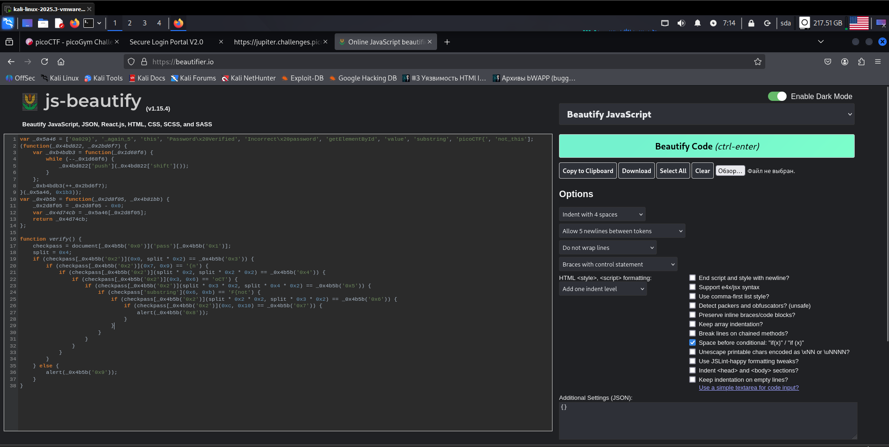

**Задание Client-side-again**

Опадаем на сайт с заданием, открываем исходный код и видим однострочник, который делаем читаемым при помощи <https://beautifier.io/> (рис 1)

Видим, что все равно идет обращение к какой-то функции «\_0x4b5b», которую попробуем вызвать через консоль и собрать флаг через вызов этой функции с разными аргументами (рис 2)

**ОТВЕТ: picoCTF\{not_this_again_50a029\}**

