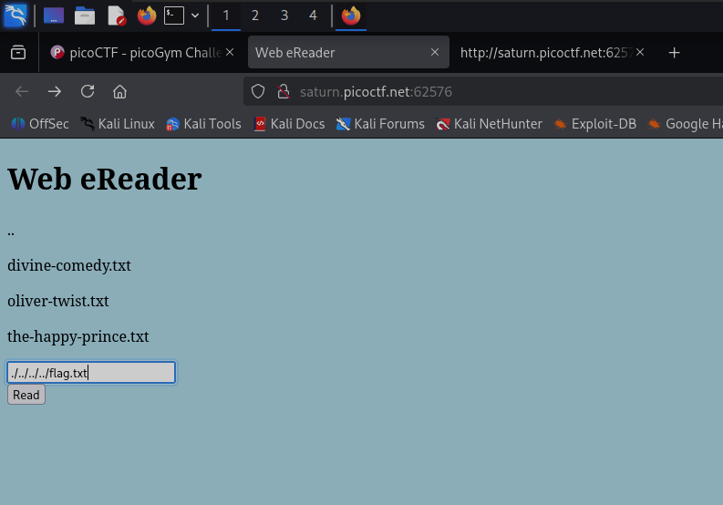

**Задание Forbidden Paths**

Этот веб-сайт имеет полезную возможность --- читать любой файл, который мы укажем по его пути. В путях к файлам предшествующий ./ обозначает текущую директорию, а ../ --- родительскую (вышестоящую) директорию. Поскольку мы знаем, что находимся в /usr/share/nginx/html/ и хотим получить доступ к /flag.txt, мы можем просто использовать путь ../../../../flag.txt, чтобы прочитать флаг. (рис 1)

**ОТВЕТ: picoCTF\{7h3_p47h_70_5ucc355_e5a6fcbc\}**

