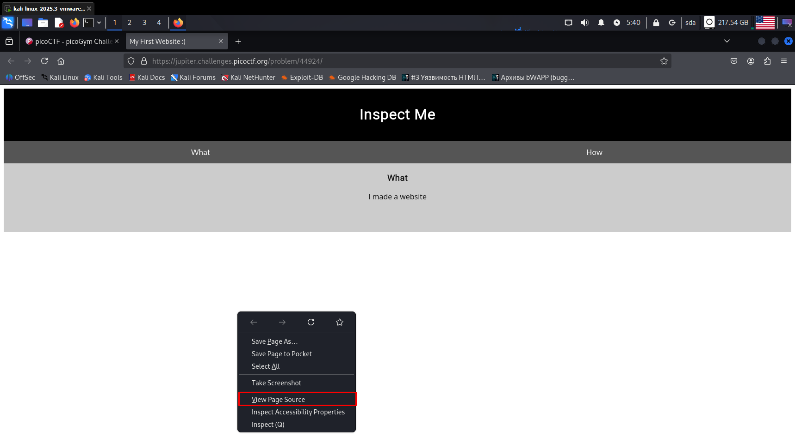
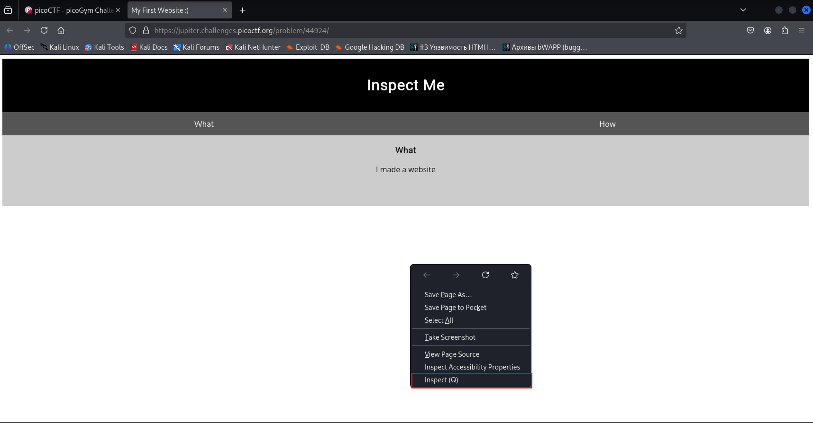
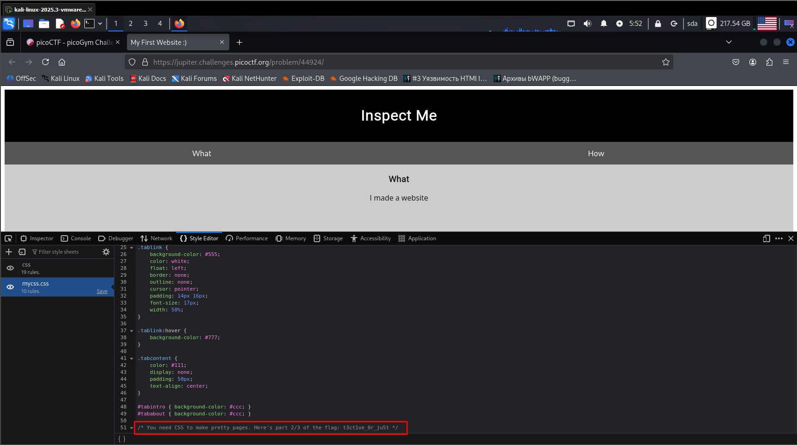

**Задание \"Insp3ct0r\"**

Переходим по ссылке (рис 1)

Правой кнопкой мыши -> view page source (рис 2)

31 строка -> часть флага - picoCTF{tru3_d3 (рис 3)

Возвращаемся на сайт. Правой кнопкой мыши -> Inspect (рис 4)

Style editor -> строка 51 -> вторая часть флага - here\'s part 2/3 of the flag: t3ct1ve_0r_ju5t (рис 5)

Тут же переходим в debugger -> myjs.js -> строка 21 -> третья часть флага - /\* Javascript sure is neat. Anyways part 3/3 of the flag: \_lucky?f10be399} \*/ (рис 6)

**ОТВЕТ: picoCTF{tru3_d3t3ct1ve_0r_ju5t_lucky?f10be399}**

