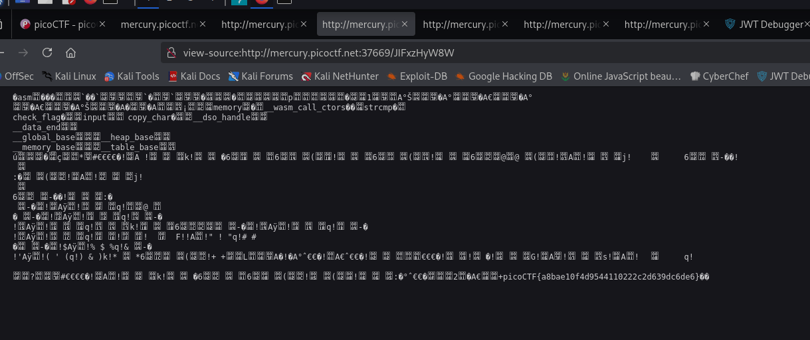

**Задание Some Assembly Required 1**

Переходим в код страницы -- переходим в G82XCw5CX3.js -- там находим упоминание /JIFxzHyW8W, поэтому преобразуем это в ссылку view-source:http://mercury.picoctf.net:37669/JIFxzHyW8W (рис 1)

Видим закодированный текст. Поэтому используем CyberChef или burp, чтобы декодировать из URL данный текст и внизу находим флаг (рис 2)

**ОТВЕТ: picoCTF\{a8bae10f4d9544110222c2d639dc6de6\}**

