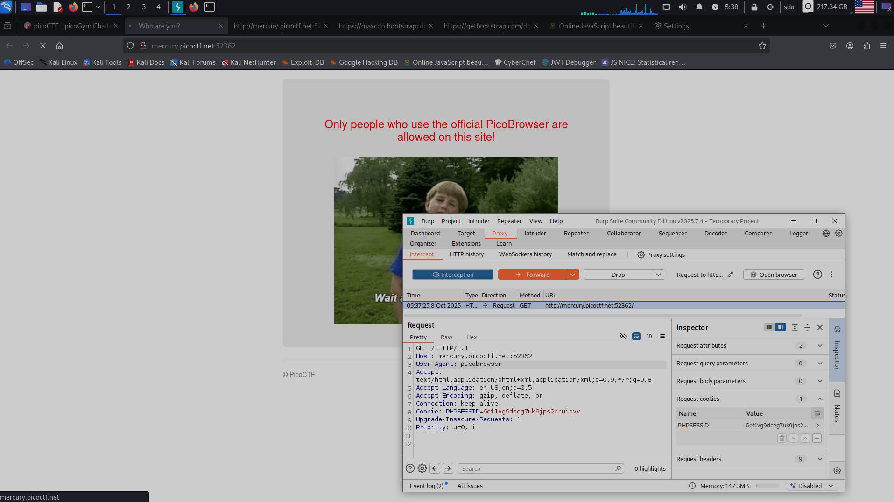
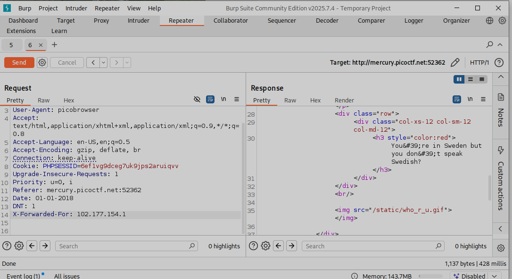
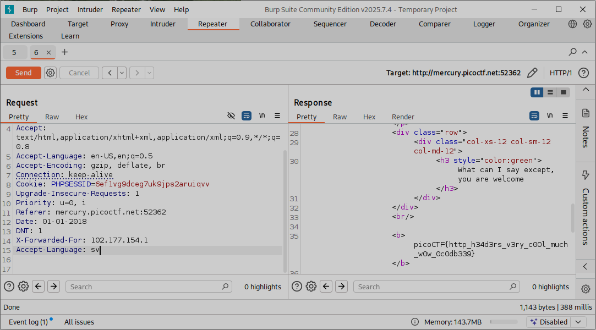

**Задание Who are you?**

Меняем user-agent на picobrowser (рис 1)

Модифицируем (рис 2)

Теперь надо изменить дату (рис 3)

Пишем DNT: 1 (Do-Not-Track) (рис 4)

Рисунок 5

Добавляем Accept-Language и флаг найден (рис 6)

**ОТВЕТ: picoCTF\{http_h34d3rs_v3ry_c0Ol_much_w0w_0c0db339\}**

