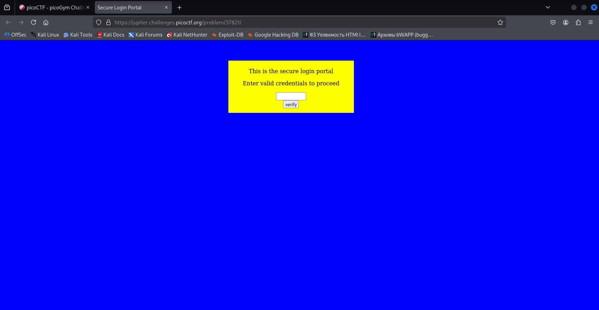
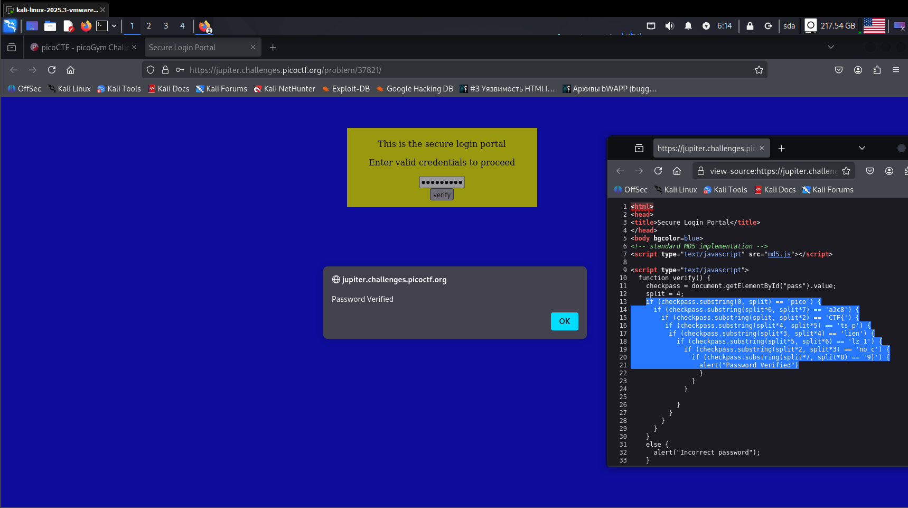

**Задание dont-use-client-side**

Переходим по ссылке и видим поле ввода пароля (рис 1)\

Рисунок 1

Правой кнопкой мыши -> смотрим исходный код (рис 2)

Собираем флаг (рис 3, 4)

**ОТВЕТ: picoCTF{no_clients_plz_1a3c89}**

