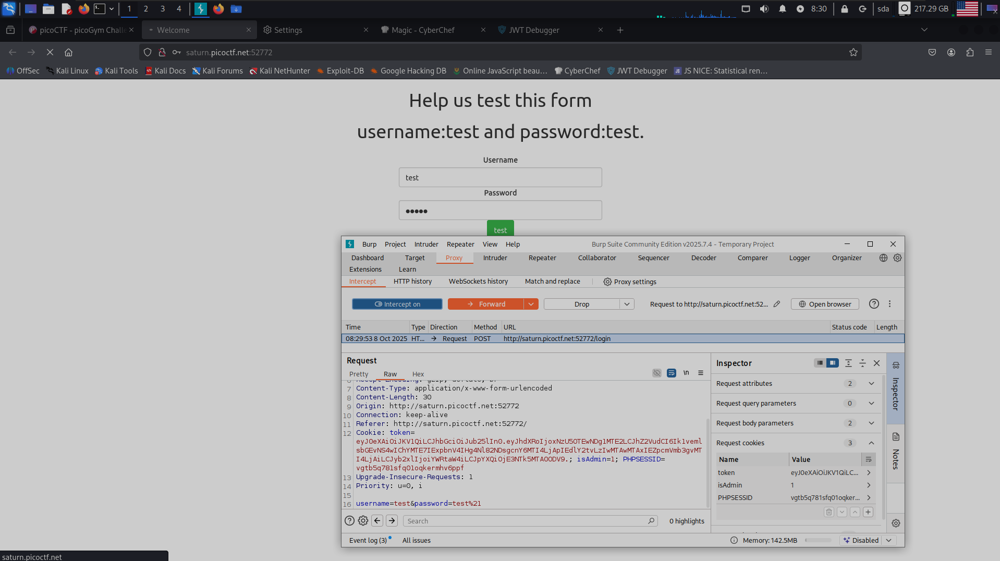
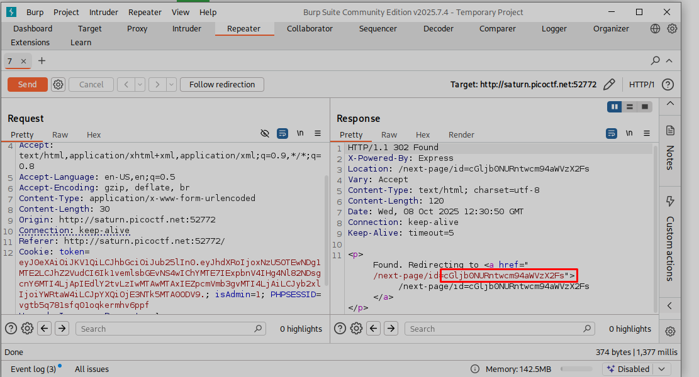
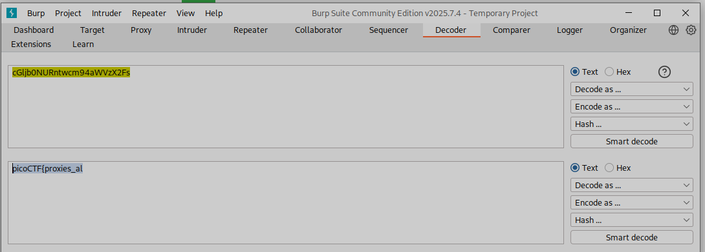

**Задание findme**

Первым шагом запускаем burp и вводим test test! (рис 1)

Пересылаем это в Repeater, нажиамем send и нам выдает ответ и в нем видно шифр (рис 2)

Рисунок 3

Следующим шагом вставляем этот id страницы и получаем торую часть зашифрованного флага (рис 4) (***[но надо снчала будет очистить куки)]{.underline}*** (рис 4)

**ОТВЕТ: picoCTF{proxies_all_the_way_25bbae9a}**

