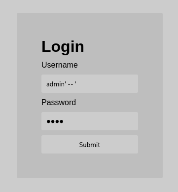
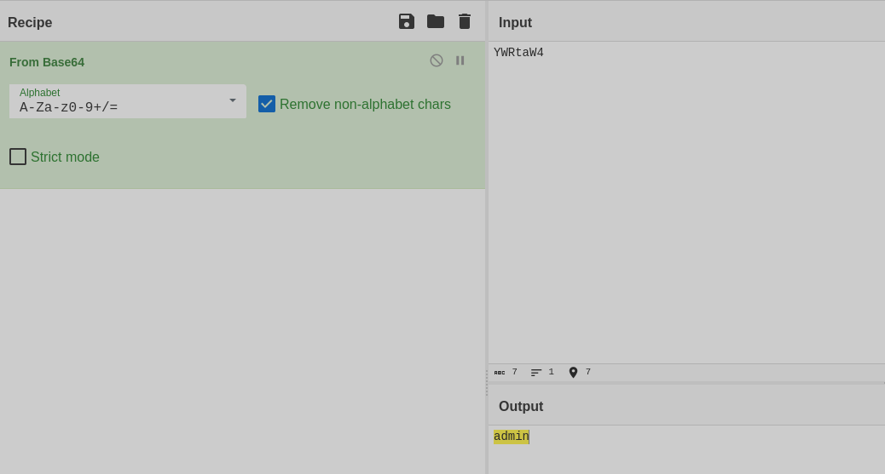
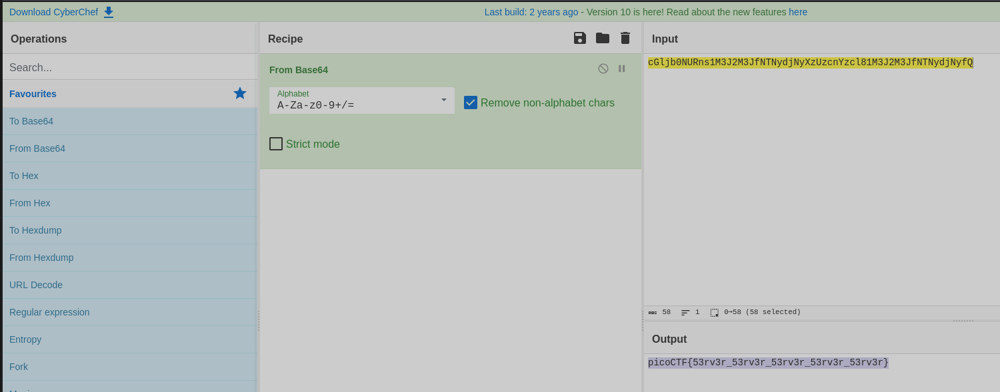

**Задание login**

Сразу пробуем sqli (рис 1)

Однако не получается. Поэтому попробуем немного усложненную sqli, которая тоже не приносит успеха. Но посмотрев в код страницы видим ссылку на index.js, где находим однострочник, который приведя в читаемый вид и проанализировав видим, что тут другая ситуацию и система, получая наш логин и пароль, кодирует в base64, а после сравнивает с «эталоном». (рис 2)

Быстро декодируем найденные нами части и видим (рис 3)

А второе закодированное слово -&gt; оказывается флагом (рис 4)

**ОТВЕТ: picoCTF\{53rv3r_53rv3r_53rv3r_53rv3r_53rv3r\}**

