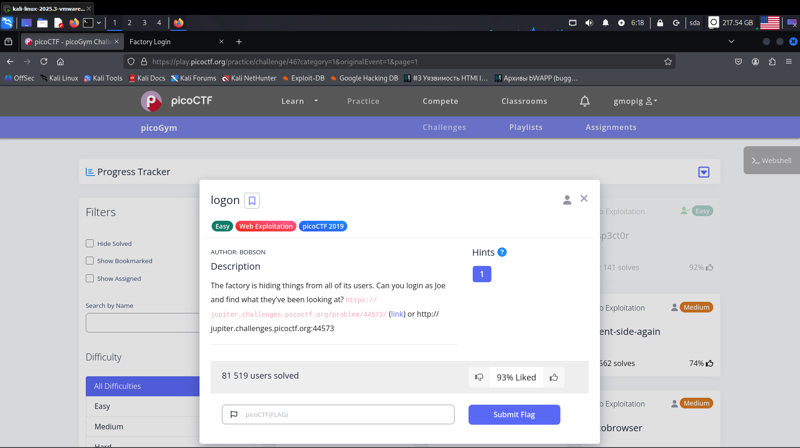
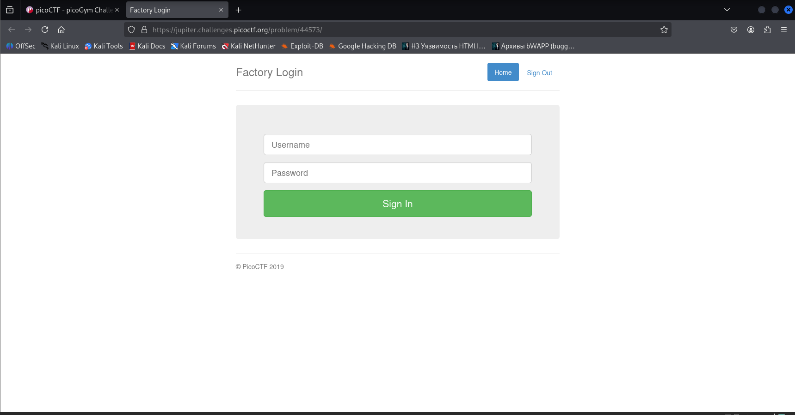
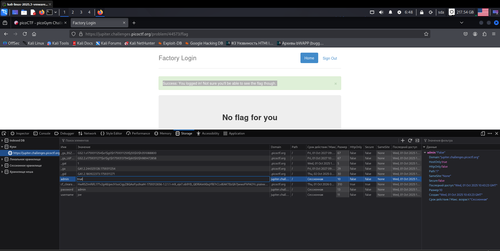

**Задание logon**

Открываем задание и переходим на указанный сайт (рис 1, 2)

Вводим любой логи и пароль -> заходим в инспектор -> storage -> куки -> ищем поле с именем «admin» и меняем значение «false» на «true» (рис 3)

Перезагружаем страницу и видим флаг (рис 4)

**ОТВЕТ: picoCTF\{th3_c0nsp1r4cy_l1v3s_0c98aacc\}**

