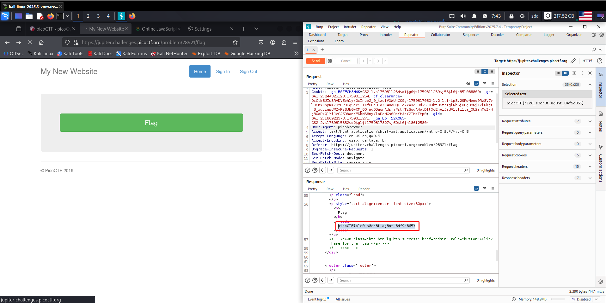

**Задание picobrowser**

Получить флаг просто по кнопке у нас не получается, потому что требуется использовать picobrowser. Понятно, что такого не существует, поэтому через burp меняем строку user-agent (рис 1)

Получилось. Флаг получен (рис 2)

**ОТВЕТ: picoCTF{p1c0_s3cr3t_ag3nt_84f9c865}**

