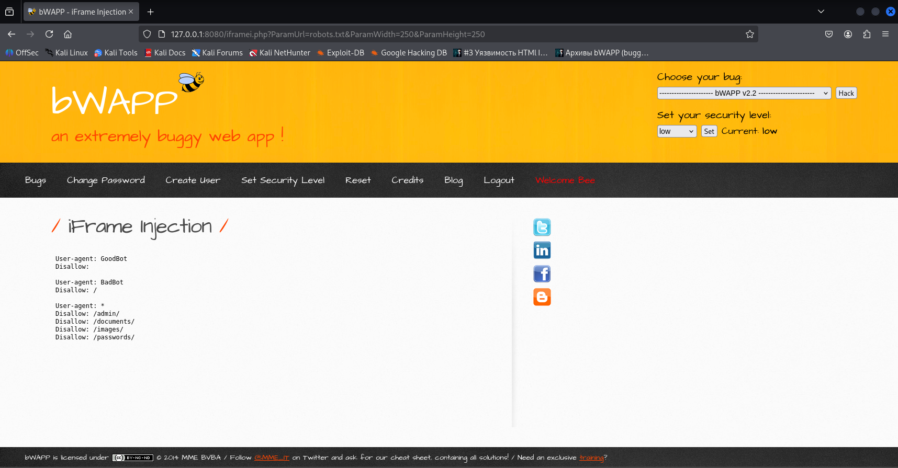
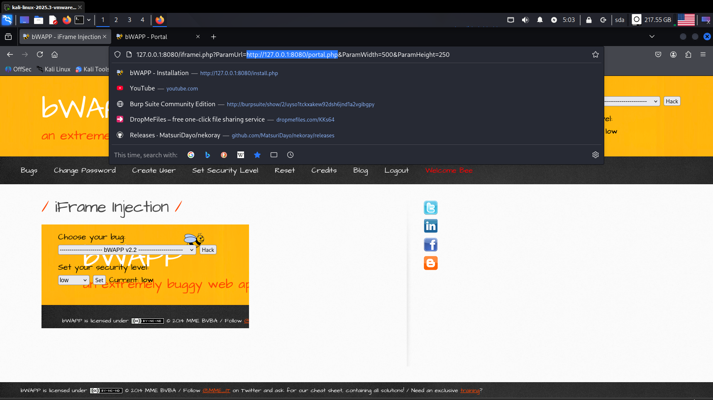

# Уязвимость iFrame-Injection уровень

**(low)**

Уязвимость **iFrame**, может быть очень опасна на сайте. В частности, можно внедрять фишинговую страницу, проводить атаки**XSS** (межсайтовый скриптинг). Для начала перейдем на уязвимую страницу **bWAPP**, которая называется "**iFrame Injection**" (рис 1)

Рисунок 1 – уязвимая страница bwapp

Меняем robot.txt на что-либо другое например на "http://127.0.0.1:8080/portal.php" (рис 2,3)

Рисунок 2 – манипуляция с поисковой строкой

Рисунок 3 – внесение изменений в командной строке

В итоге мы получили вывод сайта.