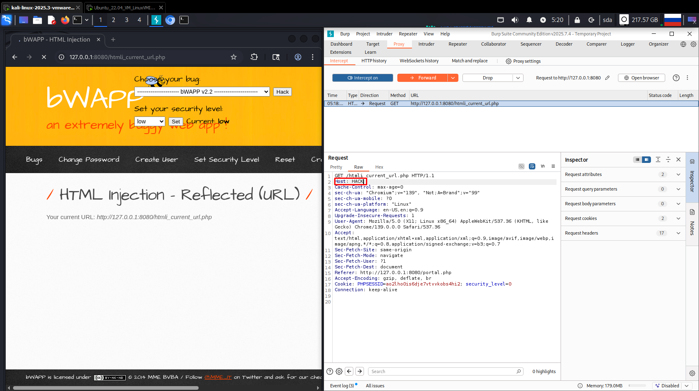

# Уязвимость HTML Injection — Reflected (Current URL) уровень low

Наша задача заключается в том, чтобы поменять имя хоста. Просто меняем ip на что-нибудь (например "HACK") (рис 1, 2).

Рисунок 1

Рисунок 2

Нажимаем "Forward", смотрим на изменившееся имя хоста на нашу запись. В итоге мы успешно проэксплуатировали данную уязвимость (рис 3).

Рисунок 3