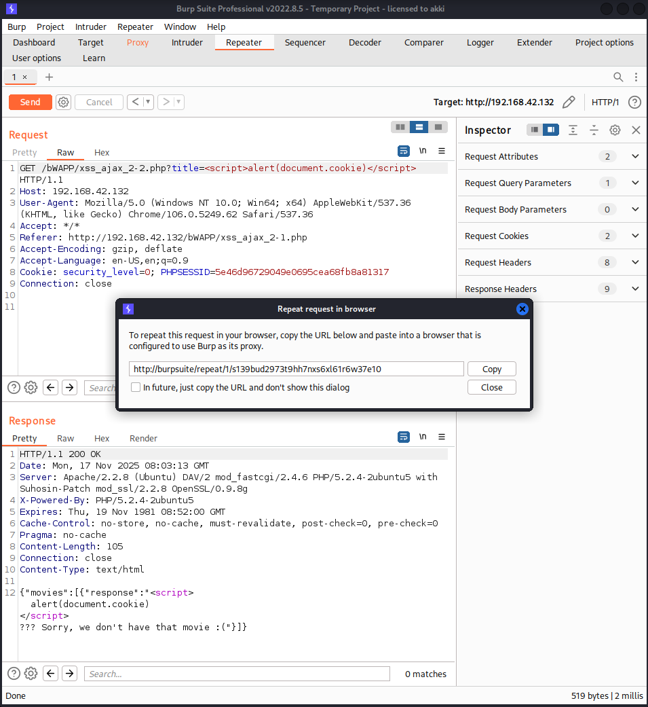

# Cross-Site Scripting - Reflected (AJAX/JSON)

Вначале перехватываем сессию бурпом, потом в поле title вставляем наш payload и копируем ссылку для браузера.

Потом отключаем перехват в бурпе и вставляем ссылку в браузер

