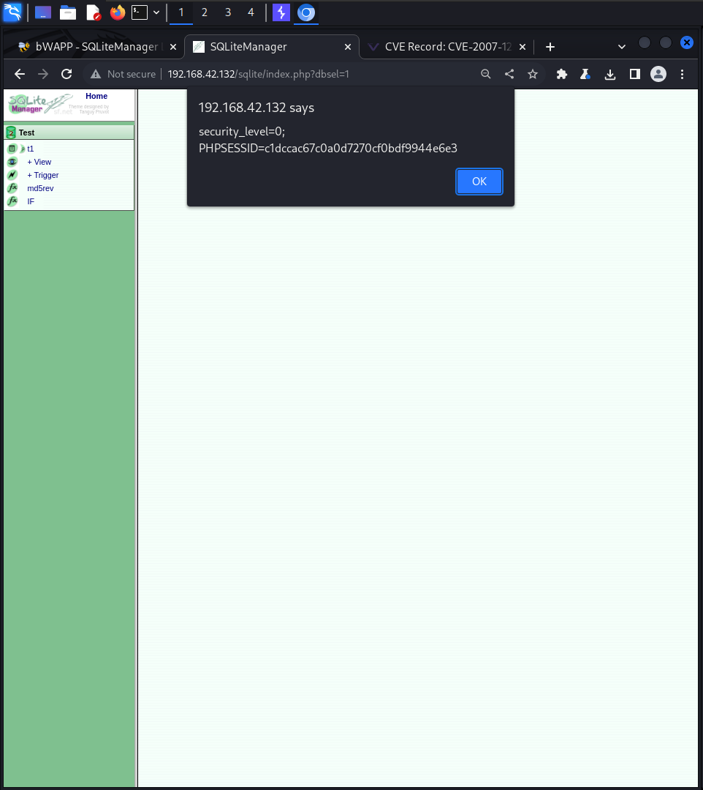

# Host Header Attack (Cache Poisoning)

Нажимаем на forward пока не упремся в страницу, как слева 9host при это один первый раз надо заменить на [www.google.com#](http://www.google.com))

Уперлись и просто отключаем перехват и нажимаем на Click here to go back to the portal.

**Local File Inclusion (SQLiteManager)**

